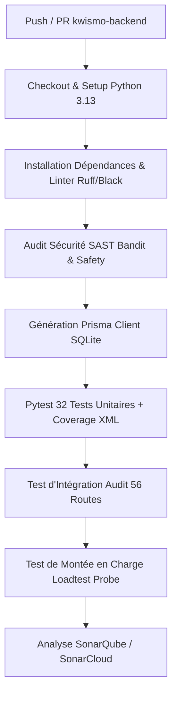

# KWISMO — Workflows GitHub Actions (CI/CD Pipeline)

Ce dossier contient l'intégralité des **pipelines d'intégration et de déploiement continus (CI/CD)** du monorepo KWISMO. Chaque sous-projet (`kwismo-backend`, `kwismo-ai`, `kwismo-web`) dispose de son propre workflow ciblé et optimisé afin d'assurer des builds rapides, parallèles et isolés.

---

## Table des Matières

1. [Vue d'Ensemble des Workflows](#-vue-densemble-des-workflows)
2. [Workflow 1 : Backend CI/CD (`backend-ci.yml`)](#-workflow-1--backend-cicd-backend-ciyml)
3. [Workflow 2 : Service IA CI/CD (`ai-ci.yml`)](#-workflow-2--service-ia-cicd-ai-ciyml)
4. [Workflow 3 : Frontend Web CI/CD (`web-ci.yml`)](#-workflow-3--frontend-web-cicd-web-ciyml)
5. [Intégration SonarQube & SonarCloud](#-intégration-sonarqube--sonarcloud)
6. [Stratégie de Cache & Performance](#-stratégie-de-cache--performance)
7. [Exécution Locale des Workflows (`act`)](#-exécution-locale-des-workflows-act)
8. [Couplage avec Railway & Render (Portes de Qualité)](#-couplage-avec-railway--render-portes-de-qualité)

---

## Vue d'Ensemble des Workflows

| Workflow | Fichier | Événements Déclencheurs | Technologies | Actions Principales |
| :--- | :--- | :--- | :--- | :--- |
| **Backend CI** | `backend-ci.yml` | `push` / `pull_request` sur `kwismo-backend/**` | Python 3.13, FastAPI, Prisma | Pytest (32 tests), Audit 56 routes, Bandit SAST, Loadtest probe, SonarQube |
| **AI Service CI** | `ai-ci.yml` | `push` / `pull_request` sur `kwismo-ai/**` | Python 3.13, LightGBM, TF-IDF | Pytest (52 cas de fraude), Audit d'inférence, Bandit SAST |
| **Frontend Web CI**| `web-ci.yml` | `push` / `pull_request` sur `kwismo-web/**` | Node 20, React, TypeScript | `tsc --noEmit`, npm audit, Vite Build |

---

## Description Détaillée des Workflows

### Workflow 1 : Backend CI/CD (`backend-ci.yml`)

Ce workflow prend en charge la sécurité, l'intégrité et la conformité du serveur Backend FastAPI :



#### Éapes exécutées :
1. **Linter & Style** : `ruff check app/` et `black --check app/`.
2. **Audit de Sécurité SAST** : `bandit -r app/` (détection d'injections SQL, clés en dur) et `safety check` (CVE dépendances).
3. **Synchronisation Prisma** : Exécution de `sync_db_provider.py --generate` pour générer le client Prisma SQLite de test.
4. **Tests Unitaires (32 tests)** : Exécution de `pytest --cov=app` couvrant tous les modules (`auth`, `users`, `user_phones`, `numbers`, `reports`, `partners`, `devices`, `otp`, `ussd`, `transactions`, `surveys`, `kpi`, `whatsapp_alerts`, `access_control`, `ai_gateway`).
5. **Audit d'Intégration des 56 Routes** : Démarrage temporaire de Uvicorn et lancement du script [`scripts/test_all_routes.py`](file:///c:/Users/PC/Desktop/kwismo/kwismo-backend/scripts/test_all_routes.py) avec validation du nettoyage idempotant.
6. **Sonde de Montée en Charge** : Test rapide de charge via [`scripts/loadtest.py`](file:///c:/Users/PC/Desktop/kwismo/kwismo-backend/scripts/loadtest.py).
7. **Rapport SonarQube** : Envoi des métriques de couverture et de qualité vers SonarCloud.

---

### Workflow 2 : Service IA CI/CD (`ai-ci.yml`)

Ce workflow valide les pipelines de Machine Learning et d'Inférence NLP :

1. **Entraînement des Modèles de Démonstration** : Exécution de `generate_model_a_data`, `model_a.train`, `clean`, `augment`, et `model_b.train`.
2. **Tests de Détection de Fraude** : Exécution de Pytest incluant les **52 scénarios réels en Camfranglais / Pidgin** ([`test_model_b_extended.py`](file:///c:/Users/PC/Desktop/kwismo/kwismo-ai/tests/test_model_b_extended.py)).
3. **Audit d'Inférence API** : Démarrage du serveur Uvicorn `kwismo-ai` et validation du script [`scripts/test_all_routes.py`](file:///c:/Users/PC/Desktop/kwismo/kwismo-ai/scripts/test_all_routes.py).

---

### Workflow 3 : Frontend Web CI/CD (`web-ci.yml`)

Ce workflow garantit l'absence d'erreurs de typage et la compilabilité de l'application Web React/Vite :

1. **Installation npm** : `npm ci` optimisé avec cache Node.
2. **Audit de Sécurité npm** : `npm audit --audit-level=high`.
3. **Vérification TypeScript Stricte** : `npx tsc --noEmit` pour interdire tout type `any` accidentel ou mauvais contrat API.
4. **Compilation Production** : `npm run build` produisant le bundle statique dans `dist/`.

---

## Intégration SonarQube & SonarCloud

Pour activer le balayage automatique SonarQube / SonarCloud sur GitHub :

1. Créez un projet sur **[SonarCloud.io](https://sonarcloud.io)** ou hébergez votre instance SonarQube.
2. Générez un jeton d'accès (`SONAR_TOKEN`).
3. Dans votre dépôt GitHub, allez dans **Settings > Secrets and variables > Actions** et ajoutez :
   - Secret Name : `SONAR_TOKEN`
   - Secret Value : *(Votre jeton SonarCloud)*

---

## Stratégie de Cache & Performance

Pour réduire le temps d'exécution sous les 2 minutes par job, les mécanismes suivants sont activés :
- **Python pip cache** : `actions/setup-python@v5` avec `cache: 'pip'`.
- **Node modules cache** : `actions/setup-node@v4` avec `cache: 'npm'`.
- **Exécution conditionnelle par chemins (`paths`)** : Un changement dans `kwismo-web/` ne déclenche **pas** le pipeline backend ni le pipeline IA.

---

## Exécution Locale des Workflows (`act`)

Vous pouvez simuler l'exécution des GitHub Actions directement sur votre machine locale grâce à l'outil **`act`** (nécessite Docker) :

```bash
# Tester le workflow Backend en local
act -W .github/workflows/backend-ci.yml

# Tester le workflow Frontend Web en local
act -W .github/workflows/web-ci.yml
```

---

## Couplage avec Railway & Render (Portes de Qualité)

Afin d'éviter tout déploiement cassé en production :

1. Sur **Railway** : Dans la configuration du service, cochez **"Wait for CI / Trigger on GitHub Action Status"**.
2. Sur **Render** : Activez les **Build Filters** ou connectez le déploiement au statut des Check Runs GitHub.

Si un test Pytest ou une vérification TypeScript échoue dans GitHub Actions, **Railway et Render bloquent automatiquement le déploiement**, protégeant ainsi l'environnement de production.
